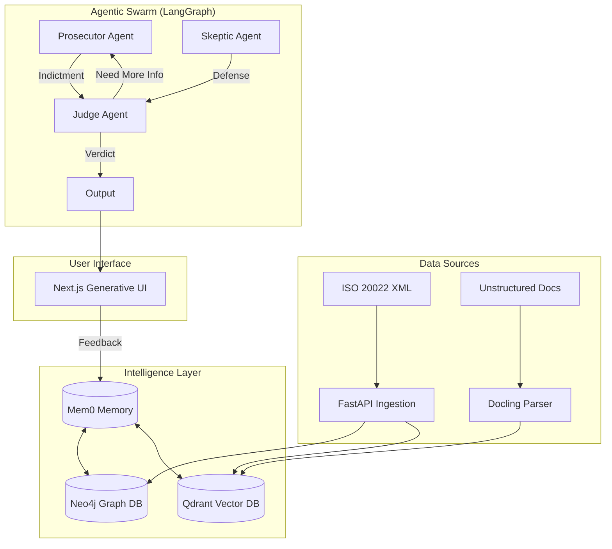
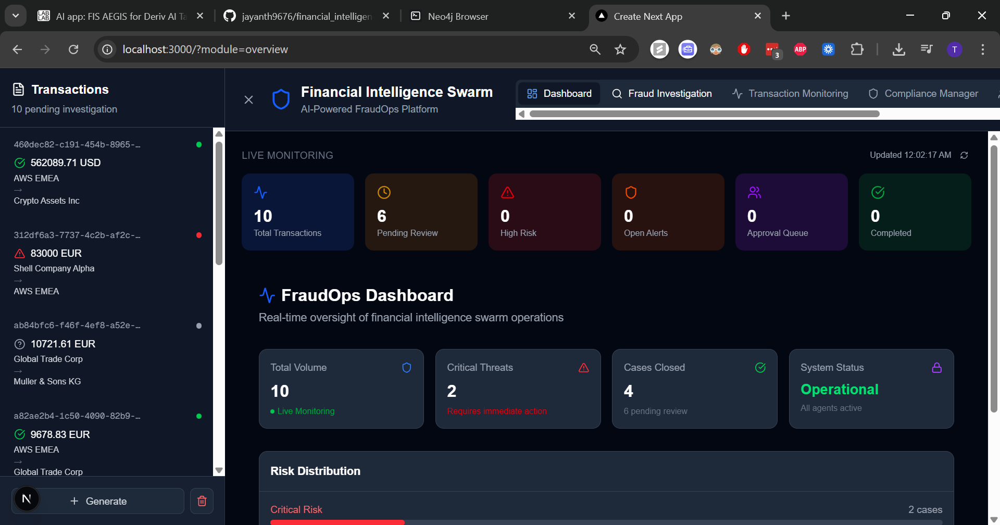
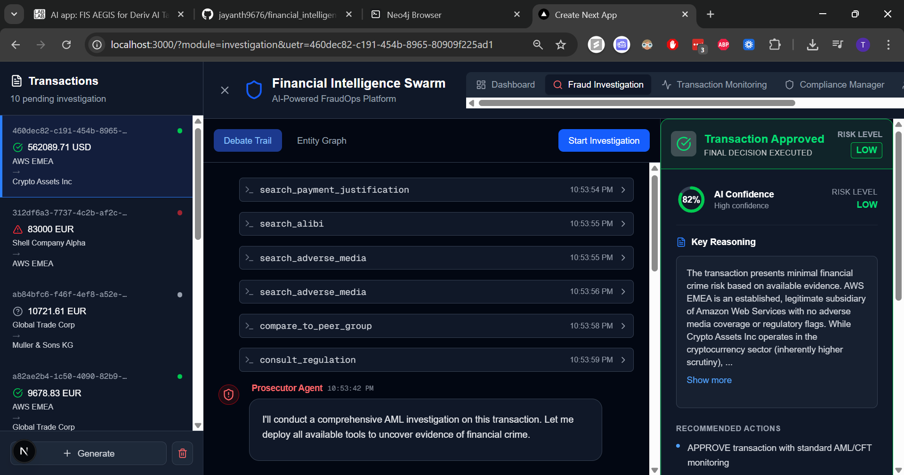
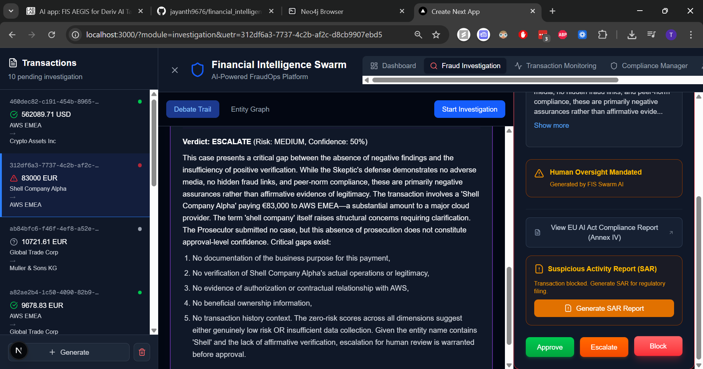
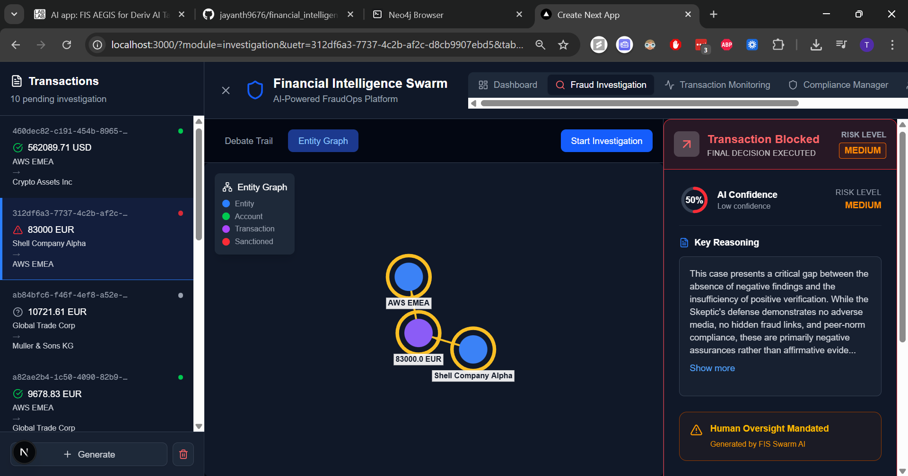
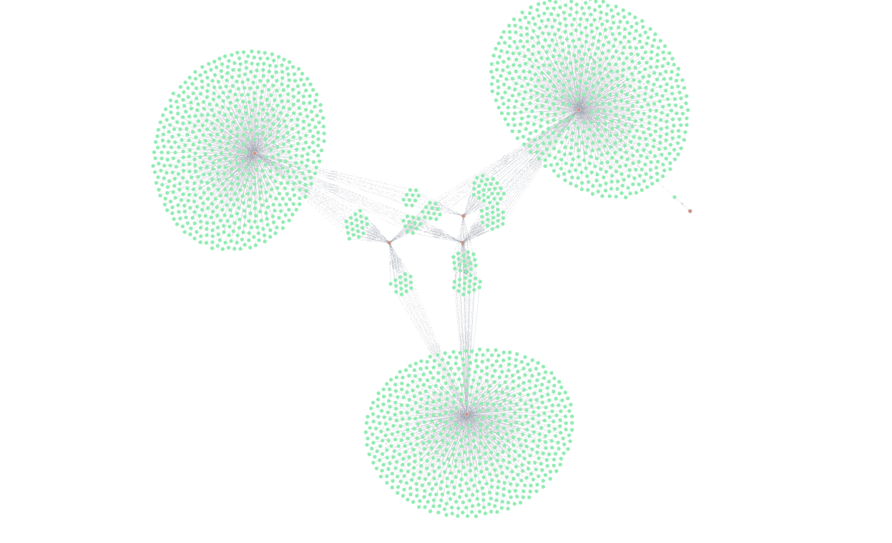
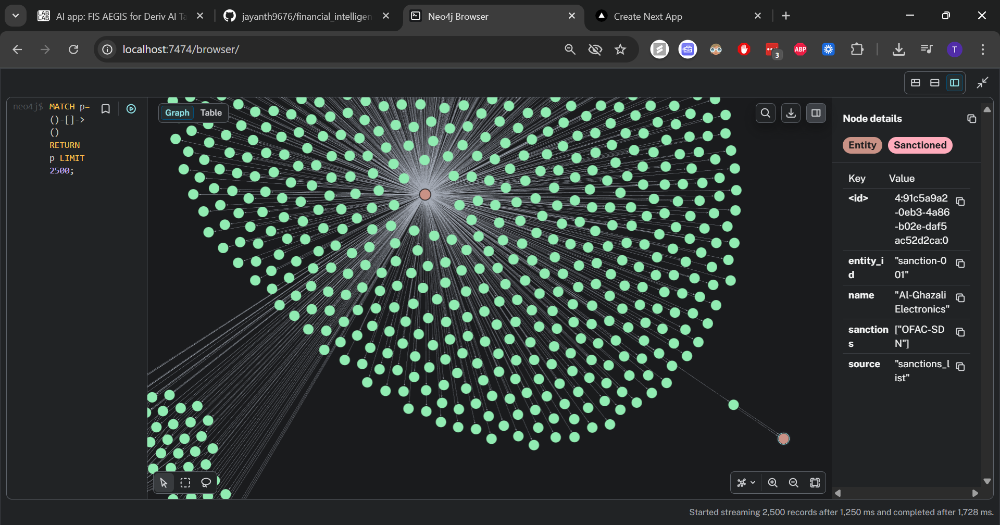

# Financial Intelligence Swarm (FIS)

**Compliance, Risk, and Anti-Fraud Architecture for the Post-ISO 20022 Era**

AI-powered fraud detection platform using a **Prosecutor-Skeptic-Judge debate pattern** for AML/CFT investigations.

## Features

- **LangGraph Agentic Architecture**: Multi-agent debate system with Prosecutor (finds fraud), Skeptic (finds alibis), and Judge (renders verdict).
- **ISO 20022 Support**: Parse pacs.008, pain.001, camt.053 XML messages using `xsdata` and `xmltodict`.
- **Reified Graph Intelligence**: Neo4j-powered hidden link detection and fraud ring analysis using a "Reified Transaction Model" where transactions are first-class nodes.
- **Semantic Search**: Qdrant vector search for document evidence (PDFs parsed via Docling) and fuzzy sanctions screening.
- **Behavioral Analysis**: Mem0-based entity profiling and drift detection to track user behavior over time.
- **EU AI Act Compliant**: Article 13 transparency and explainability built-in with human-in-the-loop checkpoints.
- **Generative UI Dashboard**: Next.js 16 frontend with streaming investigation updates using Vercel AI SDK.

## Architecture

The system utilizes a "Swarm" of specialized intelligences orchestrated by LangGraph.



### Components

1.  **Ingestion Layer**:
    *   **ISO 20022**: Parses complex XML messages (pacs.008, pain.001) into structured data.
    *   **Docling**: Converts unstructured PDFs (annual reports, KYC docs) into structured JSON/Markdown for vectorization.

2.  **Intelligence Layer**:
    *   **Neo4j (Graph)**: Uses a **Reified Transaction Model** where transactions are nodes, allowing N-ary relationships (Debtor, Creditor, IP, Device). Detects cycles and "smurfing".
    *   **Qdrant (Vector)**: Stores embeddings of remittance info and parsed documents for semantic search (e.g., fuzzy sanctions matching).
    *   **Mem0 (Memory)**: Tracks long-term entity behavior and detects "concept drift" (e.g., a sudden change in spending patterns).

3.  **Orchestration Layer (LangGraph)**:
    *   **Prosecutor**: Aggressively seeks evidence of fraud using graph and vector tools.
    *   **Skeptic**: Seeks exculpatory evidence (alibis) to defend the user.
    *   **Judge**: Weighs the arguments and renders a final verdict with a confidence score and explanation.

4.  **Presentation Layer**:
    *   **Next.js 16**: Renders the investigation in real-time.
    *   **Vercel AI SDK**: Streams text deltas and custom UI components (graphs, maps) to the frontend.

## Tech Stack

### Backend
*   **Language**: Python 3.11+
*   **Orchestration**: LangGraph, LangChain
*   **API**: FastAPI, Uvicorn
*   **Database**: Neo4j (Graph), Qdrant (Vector), Mem0 (Memory)
*   **Data Processing**: `xsdata`, `xmltodict`, `docling` (PDF parsing), `fastembed` (Embeddings)

### Frontend
*   **Framework**: Next.js 16 (React 19)
*   **Styling**: Tailwind CSS 4
*   **AI Integration**: Vercel AI SDK (`ai` package)
*   **Visualization**: `react-force-graph-2d`, Framer Motion, Lucide React

## Quick Start

### 1. Prerequisites

- Python 3.11+
- Node.js 18+
- Docker & Docker Compose
- API Keys: Google Gemini, Mem0, Qdrant

### 2. Clone and Setup

```bash
# Clone repository
git clone <repo-url>
cd deriv_agenticai_for_fraudops

# Install Python dependencies
uv sync

# Copy environment file
cp .env.example .env
# Edit .env with your API keys
```

### 3. Start Infrastructure

```bash
# Start Neo4j and Qdrant
cd docker
./start.sh   # Linux/Mac
start.bat    # Windows
```

### 4. Load Sample Data

```bash
# Hydrate databases with sample data
uv run python -m backend.loaders.main
```

### 5. Start Backend

```bash
uv run uvicorn backend.main:app --reload
# API available at http://localhost:8000
```

### 6. Start Frontend

```bash
cd frontend
npm install
npm run dev
# Dashboard available at http://localhost:3000
```

### 7. Run Demo

```bash
uv run python scripts/demo.py
```

## API Endpoints

| Endpoint | Method | Description |
|----------|--------|-------------|
| `/` | GET | Health check |
| `/ingest` | POST | Ingest ISO 20022 XML |
| `/transactions` | GET | List pending transactions |
| `/transactions/{uetr}` | GET | Get transaction details |
| `/investigate` | POST | Start streaming investigation |
| `/override/{uetr}` | POST | Human override decision |

## Target Investigation Scenario

The demo includes a target transaction (`eb9a5c8e-2f3b-4c7a-9d1e-5f8a2b3c4d5e`) that demonstrates:

1. **Prosecutor** finds hidden link via shared director to sanctioned entity
2. **Skeptic** finds Payment Grid authorization as alibi
3. **Judge** weighs evidence and renders ESCALATE verdict

This showcases the debate pattern where the payment grid explains the amount, but cannot explain the hidden link, resulting in human oversight requirement.

## Screenshots

Below are example screenshots from the demo and visualizations.













## Demo recording

Loom walkthrough: [Watch the demo on Loom](https://www.loom.com/share/d9aef77bb39c4671963110325d474c3d)

## License

Proprietary - All rights reserved
